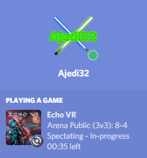

# Echo VR Tray Tool

Echo VR Tray Tool is a small, unofficial utility designed to run continuously in the background and provide various services to enhance your experience with Echo VR.

Right now, it only provides one service: Discord Rich Presence integration. In the future, more functionality such as stat tracking, party management, and streaming client integration may be provided. If you'd like to help add a service, see [Contributing](#contributing) below. For feature requests, file an issue or ask on the [Echo VR Discord server](https://discord.gg/bPB7v8d).

## Features

### Integration with Discord Rich Presence

Display your current in-game status on Discord when Echo VR is running:



## Usage

Right now, getting the tool running requires a bit of technical skill. In the future, a PyPi package (and possibly even an installer) may be provided, which will make installation significantly easier.

First, [install Python](https://www.python.org/downloads/) 3.7 and [Poetry](https://github.com/sdispater/poetry#installation). Next, download the Echo VR Tray Tool source code [via zip file](https://github.com/Ajedi32/echovr-tray-tool/releases) or with git (definitely the latter if you're planning to modify the source).

Next, open the directory containing the source in a command line terminal and run:

```
poetry install --no-dev
poetry run python -m echovr_tray_tool
```

The application should start. If you don't see it immediately, check the system tray in the bottom-right.

### Connecting to Echo VR

In order for the Echo VR Tray Tool to communicate with Echo VR, you will need to launch Echo VR via the command line and pass it the `-http` flag. Since this is rather inconvenient, we recommend that you modify the Oculus desktop client configuration to do this for you automatically.

To do this, go to the location where Oculus Desktop is installed (usually `C:\Program Files\Oculus`) and then go under Software > Manifests. Find the files `ready-at-dawn-echo-arena.json` and `ready-at-dawn-echo-arena.json.mini`. First, **make backup copies of each of these files in case something goes wrong**. Next, go to the very end of each file, find the section that says `"launchParameters":`, replace the part immediately following that that says `null,` with `"-http",` (including the quotes). Then save the files and restart Oculus Desktop (Settings -> Beta -> Restart).

If, after saving the files your Oculus desktop client will no longer start, restore the files from the backup copies you made and reboot your computer. This should fix the problem and allow you Oculus desktop to start. You're now free to either try again (make sure you follow the instructions above exactly), or file an issue in this repository or ask for help in the [Echo VR Discord Server](https://discord.gg/bPB7v8d).

Once you've modified the files and restarted Oculus desktop, launch Echo VR. Open the Echo VR Tray Tool and check that it shows the client status as "Connected". If this works, you should be good to go.

In the future, we may provide functionality within the Tray Tool itself to handle reconfiguring the Oculus Desktop client automatically.

### Generating a Shortcut

Once you have installed all dependencies (see above) you can generate a shortcut to make it easier to launch the Echo VR Tray tool in the future. Simple right-click on the `create_shortut.ps1` file in the tray tool's source directory and click "Run with PowerShell". That script should then create a `Echo VR Tray Tool.lnk` file in the source directory that you can move anywhere you want.

### Running on Start Up

TODO: Provide instructions on how to automatically run the Echo VR Tray Tool on Windows start-up.

In the future, we may provide functionality within the Tray Tool to let you run it on start-up with a single click.

## Contributing

First, [install Python](https://www.python.org/downloads/) 3.7 and [Poetry](https://github.com/sdispater/poetry#installation), and [git](https://git-scm.com/). Clone the repository with git, then open the downloaded directory in a command line (preferably git bash, which comes with git) and run:

```
poetry install
```

You can run your version of the Tray Tool with:

```
poetry run python -m echovr_tray_tool
```

### License

The Echo VR Tray Tool's source code and associated files are freely available under the [MIT License](./MIT_LICENSE). All Echo VR logos and game assets are property of Ready At Dawn Studios® (who are unaffiliated with this project). All other dependencies of the Echo VR Tray Tool (including Python, Qt, and all required Python packages) are distributed under their respective licenses.
